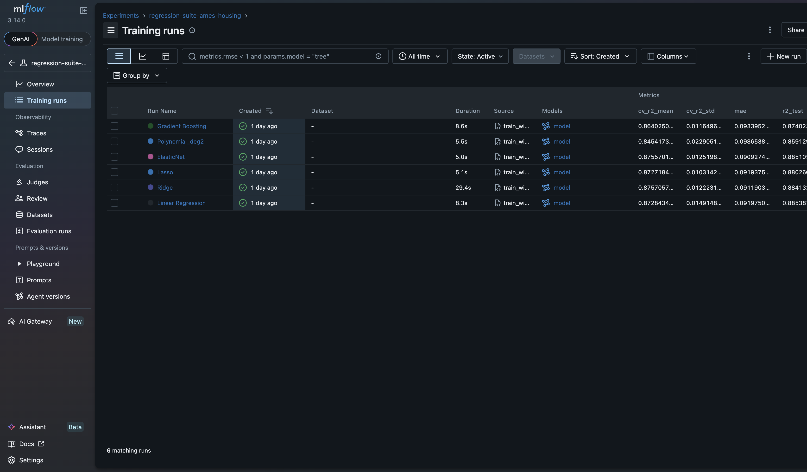
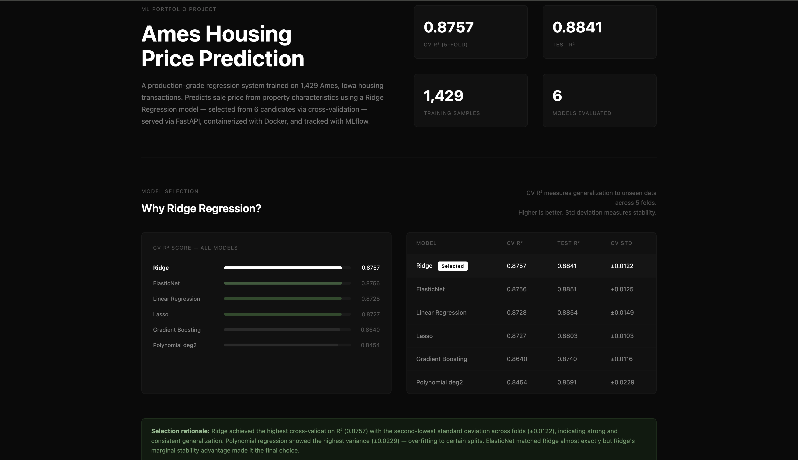
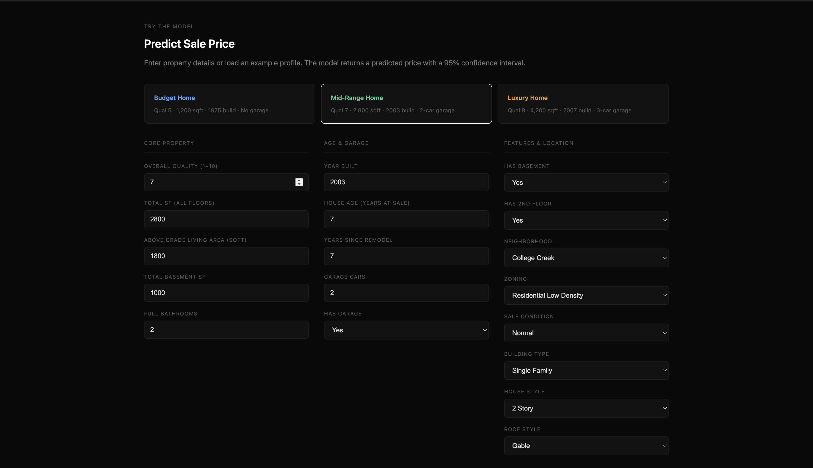
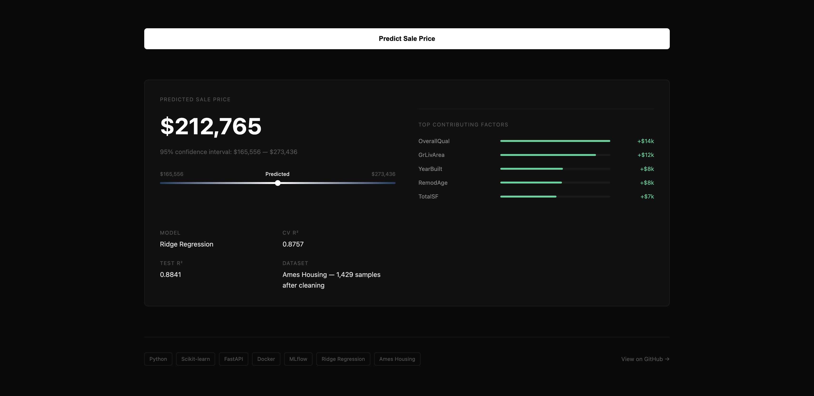

# Regression Suite — Ames Housing Price Prediction


End-to-end machine learning regression pipeline built on the Ames Housing dataset.
Covers exploratory data analysis, feature engineering, model selection, and a live
REST API served via FastAPI, containerized with Docker, tracked with MLflow,
and deployed on Render.

---

## Live Demo

Frontend: https://Rehankhan575.github.io/regression-suite/
API Documentation: https://regression-suite.onrender.com/docs
Health Check: https://regression-suite.onrender.com/health

---
## Strucutre
```text
regression-suite/
├── housing_analysis.ipynb       # Full notebook — EDA to model evaluation
├── train_with_mlflow.py         # Training script with MLflow experiment tracking
├── api.py                       # FastAPI prediction service
├── Dockerfile                   # Docker configuration
├── .dockerignore                # Files excluded from Docker build
├── requirements.txt             # Full dependencies for notebook and training
├── requirements-api.txt         # Minimal dependencies for API deployment
├── best_model_pipeline.joblib   # Serialized best model pipeline (Ridge)
├── docs/
│   └── index.html               # GitHub Pages frontend
├── screenshots/
│   ├── target_distribution.png
│   ├── missing_data.png
│   ├── model_comparison.png
│   ├── residuals_analysis.png
│   ├── feature_coefficients.png
│   ├── mlflow_runs.png
│   ├── frontend_demo1.png
│   ├── frontend_demo2.png
│   └── frontend_demo3.png
└── README.md
```

---

## Workflow

### 1. Exploratory Data Analysis
- Shape, dtypes, and statistical summary across all 81 columns
- Missing data analysis — 19 columns with missing values identified and visualized
- Target variable distribution — SalePrice confirmed right-skewed (skewness = 1.88)
- Log transformation applied to normalize target (post-transform skewness = 0.12)
- Correlation analysis across all numeric features
- Multicollinearity check — redundant features removed at 0.7 threshold
- Outlier detection using IQR — 31 outliers removed from GrLivArea

### 2. Feature Engineering

| Feature | Formula | Rationale |
|---|---|---|
| TotalSF | TotalBsmtSF + 1stFlrSF + 2ndFlrSF | Total living area across all floors |
| HouseAge | YrSold - YearBuilt | Age of house at time of sale |
| RemodAge | YrSold - YearRemodAdd | Years since last remodel |
| HasPool | PoolArea > 0 | Binary presence flag |
| HasGarage | GarageArea > 0 | Binary presence flag |
| Has2ndFloor | 2ndFlrSF > 0 | Binary presence flag |
| HasBsmt | TotalBsmtSF > 0 | Binary presence flag |

### 3. Preprocessing Pipeline
Built using scikit-learn ColumnTransformer + Pipeline — no data leakage.

- Numeric (12 features): Median imputation then StandardScaler
- Categorical (6 features): Mode imputation then OneHotEncoder

### 4. Model Comparison

| Model | CV R² | CV Std | Test R² |
|---|---|---|---|
| Ridge | 0.8757 | 0.0122 | 0.8841 |
| ElasticNet | 0.8756 | 0.0125 | 0.8851 |
| Linear Regression | 0.8728 | 0.0149 | 0.8854 |
| Lasso | 0.8727 | 0.0103 | 0.8803 |
| Gradient Boosting | 0.8640 | 0.0116 | 0.8740 |
| Polynomial (deg 2) | 0.8454 | 0.0229 | 0.8591 |

Selected model: Ridge Regression — highest CV R² with lowest standard deviation,
indicating consistent generalization across all folds.

### 5. MLflow Experiment Tracking
All 6 model runs logged to a SQLite backend with parameters, metrics, and artifacts.
Best run tagged automatically.

### 6. Residual Analysis
- Random scatter around zero — no systematic bias detected
- Residual distribution approximately normal
- Minor heteroscedasticity at higher predicted values

---

## API Reference

### GET /health
```json
{"status": "ok", "model": "Ridge Regression", "dataset": "Ames Housing"}
```

### POST /predict

Request body:
```json
{
  "OverallQual": 7,
  "TotalSF": 2800,
  "GrLivArea": 1800,
  "GarageCars": 2,
  "TotalBsmtSF": 1000,
  "FullBath": 2,
  "YearBuilt": 2003,
  "HouseAge": 7,
  "RemodAge": 7,
  "HasGarage": 1,
  "HasBsmt": 1,
  "Has2ndFloor": 1,
  "Neighborhood": "CollgCr",
  "MSZoning": "RL",
  "SaleCondition": "Normal",
  "BldgType": "1Fam",
  "HouseStyle": "2Story",
  "RoofStyle": "Gable"
}
```

Response includes predicted price, 95% confidence interval, top contributing
features with dollar impact, and model metadata.

---

## Key Visuals

### Target Distribution


### Missing Data Pattern


### Model Comparison


### Residual Analysis


### Feature Coefficients


### MLflow Runs & Experiment Tracking


### Frontend Demo — Main Dashboard


### Frontend Demo — Model Rationale & Statistics


### Frontend Demo — Predictions & Coefficients Analysis


---

## Run Locally

### With Docker
```bash
git clone https://github.com/Rehankhan575/regression-suite.git
cd regression-suite
docker build -t regression-suite .
docker run -p 8000:8000 regression-suite
```

Visit http://localhost:8000/docs

### Without Docker
```bash
pip install -r requirements-api.txt
uvicorn api:app --host 0.0.0.0 --port 8000
```

---

## Tech Stack

| Layer | Tools |
|---|---|
| Data Analysis | pandas, numpy, matplotlib, seaborn, scipy |
| Machine Learning | scikit-learn — Pipeline, ColumnTransformer, 6 models |
| Experiment Tracking | MLflow 3.14 — SQLite backend |
| API | FastAPI, Pydantic, uvicorn |
| Containerization | Docker |
| Deployment | Render — Docker Web Service |
| Frontend | HTML, CSS — GitHub Pages |

---

## Roadmap

- [ ] GitHub Actions CI/CD pipeline
- [ ] Model registry via MLflow
- [ ] Batch prediction endpoint
- [ ] Rate limiting and authentication

---

## Author

Rehan Khan
[GitHub](https://github.com/Rehankhan575)
